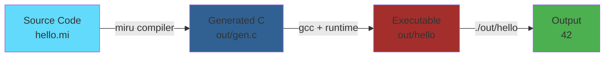

<div align="center">

# 🚀 Miru Quick Start Guide

### Get Up and Running in 5 Minutes

_Build, compile, and run your first Miru program_

<p align="center">
  
  
  
</p>

<p align="center" style="font-weight: bold;">
  <a href="#-installation">Installation</a> •
  <a href="#-your-first-program">First Program</a> •
  <a href="#-more-examples">Examples</a> •
  <a href="#-troubleshooting">Troubleshooting</a>
</p>

</div>

---

## 📋 Prerequisites

<table>
<tr>
<td align="center" width="33%">
<br/>
<b>C Compiler</b>
</td>
<td align="center" width="33%">
<br/>
<b>Build Tool</b>
</td>
<td align="center" width="33%">
<br/>
<b>Shell (Git Bash on Windows)</b>
</td>
</tr>
</table>

### Check Your Setup

```bash
gcc --version    # Should show GCC 7.0+
make --version   # Should show GNU Make 4.0+
```

---

## ⚡ Installation

### 1. Clone the Repository

```bash
git clone https://github.com/yourusername/MiruScript.git
cd MiruScript
```

### 2. Build the Compiler

```bash
make clean
make
```

**Expected output:**
```
gcc -std=c11 -Wall -Wextra -pedantic -Iruntime -Isrc -c src/lexer.c -o src/lexer.o
gcc -std=c11 -Wall -Wextra -pedantic -Iruntime -Isrc -c src/parser.c -o src/parser.o
...
gcc -std=c11 -Wall -Wextra -pedantic -Iruntime -Isrc -o miru src/*.o
```

✅ **Success!** You now have the `miru` compiler executable.

---

## 🎯 Your First Program

### Hello World

Create a file `hello.mi`:

```c
// hello.mi - Your first Miru program
print(42);
```

**Note**: Use `c` syntax highlighting in markdown since `miru` isn't supported yet.

### Compile and Run

```bash
# Step 1: Compile Miru → C
./miru hello.mi

# Step 2: Compile C → Binary
gcc -o out/hello out/gen.c runtime/print.c

# Step 3: Run
./out/hello
```

**Output:**
```
42
```

🎉 **Congratulations!** You've run your first Miru program!

---

## 📚 More Examples

<table>
<tr>
<td width="50%">

### 🔢 Fibonacci Sequence

**Difficulty**: ⭐⭐ Intermediate

```c
func fib(n) {
    if (n <= 1) {
        return n;
    }
    return fib(n - 1) + fib(n - 2);
}

print(fib(10));
```

**Output:** `55`

**Learn:** Recursion, base cases

</td>
<td width="50%">

### 🎲 Factorial

**Difficulty**: ⭐⭐ Intermediate

```c
func factorial(n) {
    if (n <= 1) {
        return 1;
    }
    return n * factorial(n - 1);
}

print(factorial(5));
```

**Output:** `120`

**Learn:** Recursion, multiplication

</td>
</tr>
</table>

---

<table>
<tr>
<td width="50%">

### ➕ Sum Using Loops

**Difficulty**: ⭐⭐ Easy

```c
func sum_to_n(n) {
    let sum = 0;
    let i = 1;
    while (i <= n) {
        sum = sum + i;
        i = i + 1;
    }
    return sum;
}

print(sum_to_n(100));
```

**Output:** `5050`

**Learn:** Loops, variables

</td>
<td width="50%">

### ⚡ Compile & Run

**All examples use the same commands:**

```bash
# Method 1: Step-by-step
./miru fib.mi
gcc -o out/fib out/gen.c runtime/print.c
./out/fib

# Method 2: One-liner
./miru fib.mi && gcc -o out/fib out/gen.c runtime/print.c && ./out/fib
```

**Replace `fib` with any example name!**

</td>
</tr>
</table>

---

## 🔧 Understanding the Pipeline



### What Happens?

1. **Miru Compiler** (`./miru hello.mi`):
   - Lexer tokenizes your code
   - Parser builds an Abstract Syntax Tree
   - CodeGen emits C code to `out/gen.c`

2. **GCC Compilation** (`gcc -o out/hello out/gen.c runtime/print.c`):
   - Compiles generated C code
   - Links with Miru runtime library
   - Produces native executable

3. **Execution** (`./out/hello`):
   - Runs the compiled program
   - Outputs results

---

## 🛠️ Common Tasks

### Run Existing Examples

```bash
# All examples are in examples/ directory
./miru examples/hello.mi && gcc -o out/hello out/gen.c runtime/print.c && ./out/hello
./miru examples/fib.mi && gcc -o out/fib out/gen.c runtime/print.c && ./out/fib
./miru examples/prime.mi && gcc -o out/prime out/gen.c runtime/print.c && ./out/prime
```

### Run Tests

```bash
make test
# or manually:
cd tests
bash run_all.sh
```

### Clean Build Artifacts

```bash
make clean
```

---

## 📖 Language Basics

<table>
<tr>
<td width="50%">

### 📦 Variables

```c
let x = 10;        // Mutable
const MAX = 100;   // Constant
```

### 🔄 Functions

```c
func add(a, b) {
    return a + b;
}
print(add(5, 3));  // 8
```

### 🔀 Conditionals

```c
if (x > 0) {
    print(1);
} else {
    print(0);
}
```

</td>
<td width="50%">

### 🔁 Loops

```c
let i = 1;
while (i <= 5) {
    print(i);
    i = i + 1;
}
// Output: 1, 2, 3, 4, 5
```

### ⚙️ Operators

```c
// Arithmetic: + - * / %
let sum = 5 + 3;      // 8

// Comparison: == != < > <= >=
if (x == 10) { }

// Logical: && || !
if (a && b) { }
```

</td>
</tr>
</table>

---

## 🐛 Troubleshooting

<table>
<tr>
<td width="50%">

### ❌ Error: `miru: command not found`

**Solution**: Build the compiler first

```bash
make
```

---

### ❌ Error: `gcc: command not found`

**Solution**: Install GCC

```bash
# Ubuntu/Debian
sudo apt-get install build-essential

# macOS
xcode-select --install

# Windows - Install MinGW or MSVC
```

</td>
<td width="50%">

### ❌ Error: Parse errors

**Common fixes**:
- ✅ Add semicolons `;` at end of statements
- ✅ Match braces `{` and `}`
- ✅ Use valid operators and keywords

---

### ❌ Generated C Won't Compile

**Debug steps**:

```bash
# View generated code
cat out/gen.c
```

**Check for**:
- Missing includes
- Syntax errors
- Type mismatches

</td>
</tr>
</table>

---

## 📚 Next Steps

<table>
<tr>
<td align="center" width="25%">
<br/>
<b>Explore Examples</b><br/>
Check out all 10 examples<br/>
<a href="examples/Examples.md">Examples.md</a>
</td>
<td align="center" width="25%">
<br/>
<b>Learn Syntax</b><br/>
Complete reference<br/>
<a href="KEYWORDS.md">KEYWORDS.md</a>
</td>
<td align="center" width="25%">
<br/>
<b>Write Programs</b><br/>
Build your own<br/>
Custom algorithms
</td>
<td align="center" width="25%">
<br/>
<b>Try Patterns</b><br/>
Test algorithms<br/>
Optimize code
</td>
</tr>
</table>

### 🎯 Recommended Learning Path

<table>
<tr>
<td width="33%">

**⭐ Beginner**
- [hello.mi](examples/hello.mi) - Basic syntax
- [max.mi](examples/max.mi) - Conditionals

</td>
<td width="33%">

**⭐⭐ Intermediate**
- [sum.mi](examples/sum.mi) - Loops
- [fib.mi](examples/fib.mi) - Recursion
- [fact.mi](examples/fact.mi) - More recursion

</td>
<td width="33%">

**⭐⭐⭐ Advanced**
- [gcd.mi](examples/gcd.mi) - Algorithms
- [prime.mi](examples/prime.mi) - Optimization
- [ackermann.mi](examples/ackermann.mi) - Deep recursion

</td>
</tr>
</table>

---

## 💡 Pro Tips

<table>
<tr>
<td width="33%">

### ⚡ One-Liner

**Create an alias:**

```bash
alias mirun='function _mirun() {
  ./miru "$1" &&
  gcc -o "out/$(basename "$1" .mi)" \
  out/gen.c runtime/print.c &&
  "./out/$(basename "$1" .mi)";
}; _mirun'
```

**Use it:**
```bash
mirun examples/fib.mi
```

</td>
<td width="33%">

### 🔍 View Generated C

**Inspect transpiled code:**

```bash
./miru examples/fib.mi
cat out/gen.c
```

**Learn how Miru** translates to C by examining the generated code!

</td>
<td width="33%">

### 🐛 Debug Mode

**Compile with symbols:**

```bash
gcc -g -o out/fib \
  out/gen.c \
  runtime/print.c
```

**Debug with GDB:**
```bash
gdb out/fib
```

</td>
</tr>
</table>

---

<div align="center">

## 🎓 More Resources

<table>
<tr>
<td align="center">
<b>Language Reference</b><br/>
Complete keyword guide<br/>
<a href="KEYWORDS.md">KEYWORDS.md</a>
</td>
<td align="center">
<b>Examples</b><br/>
10 complete programs<br/>
<a href="examples/Examples.md">Examples.md</a>
</td>
<td align="center">
<b>Main Documentation</b><br/>
Project overview<br/>
<a href="README.md">README.md</a>
</td>
</tr>
</table>

---

**Ready to Build Something Amazing?** 🚀

[← Back to README](README.md)

</div>
